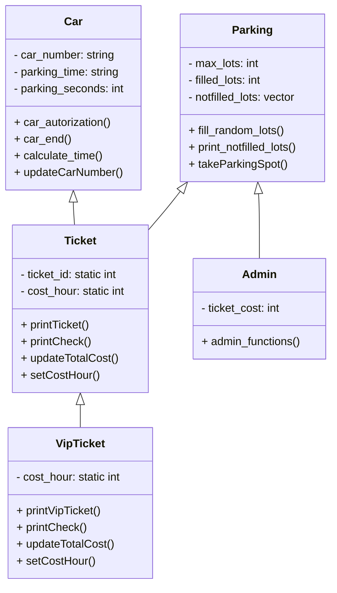

# 🚗 Parking Management System

### 👥 Group project by Alan, Mark, Ilja, Martins

A C++ simulation of a smart parking system that allows users to register their car, purchase tickets (default or VIP), view parking availability, and calculate cost based on parking duration. Admin functionality is also included to manage ticket prices and monitor available spaces.

---

## 🧩 Features

- 🔐 **Car Authorization**: Input car number and simulate entry.
- 🎟️ **Ticket Types**:
  - **Default Ticket** (Customizable cost)
  - **VIP Ticket** (Higher cost, simulated perks)
- ⏳ **Time Simulation**: Random parking time duration.
- 💰 **Cost Calculation**: Based on time parked and ticket type.
- 📋 **Admin Panel**:
  - Set prices for default and VIP tickets
  - View available parking lots
- 📍 **Randomized Lot Assignment**: Realistic random distribution of filled/available spots.

---

## 🛠️ Classes Overview

### `Car`
Handles user interaction:
- Entering car number
- Displaying time
- Confirming exit

### `Parking`
Manages parking spots:
- 50 total spots
- Randomly filled lots to simulate realism
- Functions for printing and selecting available spots

### `Ticket` (inherits `Car`, `Parking`)
- Generates unique ticket ID
- Calculates parking cost for default users
- Displays full ticket/check info

### `VipTicket` (inherits `Ticket`)
- VIP version of the ticket
- Higher customizable hourly rate
- Enhanced formatting in output

### `Admin` (inherits `Parking`)
- Set prices for ticket types
- View current availability
- Password-protected menu

---

## 🧪 Program Flow

1. **Main Menu**
    - Parking Authorization
    - Admin Panel
    - Exit

2. **User Flow**
    - Enter car number
    - Choose ticket type
    - View available lots
    - Select parking spot
    - End parking session
    - Display cost/check

3. **Admin Flow**
    - Password: `Mark228`
    - Set hourly prices
    - View free/filled lots

---

## 🧮 Ticket Price Example

- **Default**: 20$/hr  
- **VIP**: 40$/hr  
- Duration randomly set between ~1 to 50 minutes

### Example Output:

- Car number: EX-8083
- Ticket ID: 2
- Place number: 17
- Cost per hour: 20
- Total time: 0h 25m
- Total cost: 8.33$

---

## 📊 Visual Class Diagram (Mermaid)

### 🔑 Admin Password
Mark228

## 👨‍👩‍👦 Team and Contributions

> This project was developed as a group collaboration. Each member focused on specific components and functionality.

| Member     | Contribution                              |
|------------|-------------------------------------------|
| **Alan**   | 🔧 Main integrator and Leader, wrote `main.cpp`, linked all modules, fixed logic bugs, handled I/O and actually worked with everything |
| **Ilja**   | 🅿️ Responsible for parking logic and randomness (`park.cpp`) |
| **Martins**| 🎟️ Created the `Ticket` system and cost logic (`ticket.cpp`) |
| **Mark**   | 💎 Implemented `VipTicket` features and formatting |

💡 *GitFlow was not used at the time of development. Code was written in separate files and merged manually by Alan.*

---
