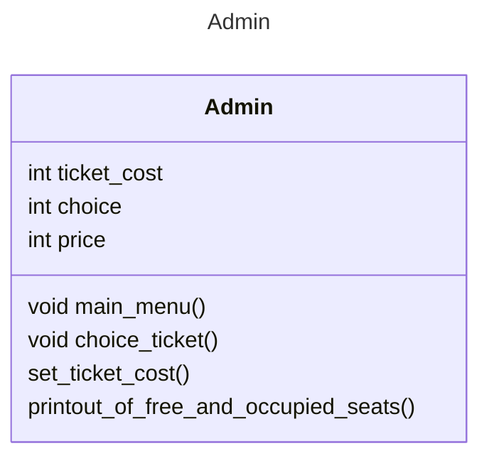

```mermaid
---
title: Admin
---
classDiagram
    class Admin

        Admin: int ticket_cost
        Admin: int choice
        Admin: int price
        Admin: void main_menu()
        Admin: void choice_ticket()
        Admin: set_ticket_cost()
        Admin: printout_of_free_and_occupied_seats()

```