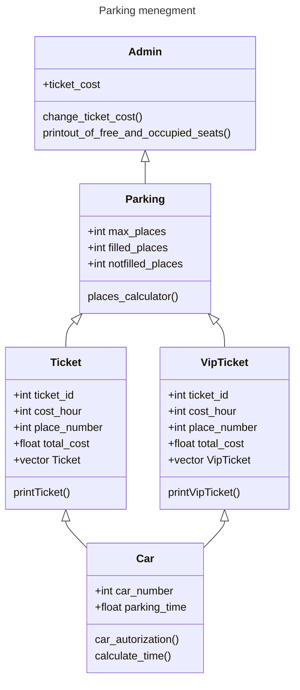

```mermaid
--- 
title: Parking menegment
---
classDiagram
    class Car
        Car : +int car_number
        Car : +float parking_time
        Car : car_autorization()
        Car : calculate_time()

    class Parking
        Parking : +int max_places
        Parking : +int filled_places
        Parking : +int notfilled_places
        Parking : places_calculator()

    class Ticket
        Ticket : +int ticket_id
        Ticket : +int cost_hour
        Ticket : +int place_number
        Ticket : +float total_cost
        Ticket : +vector Ticket
        Ticket : printTicket()

    class VipTicket
        VipTicket : +int ticket_id
        VipTicket : +int cost_hour
        VipTicket : +int place_number
        VipTicket : +float total_cost
        VipTicket : +vector VipTicket
        VipTicket : printVipTicket()
    
    class Admin
        Admin : +ticket_cost
        Admin : change_ticket_cost()
        Admin : printout_of_free_and_occupied_seats()
    

    Ticket <|-- Car
    VipTicket <|-- Car
    
    Admin <|-- Parking
    Parking <|-- Ticket
    Parking <|-- VipTicket
```