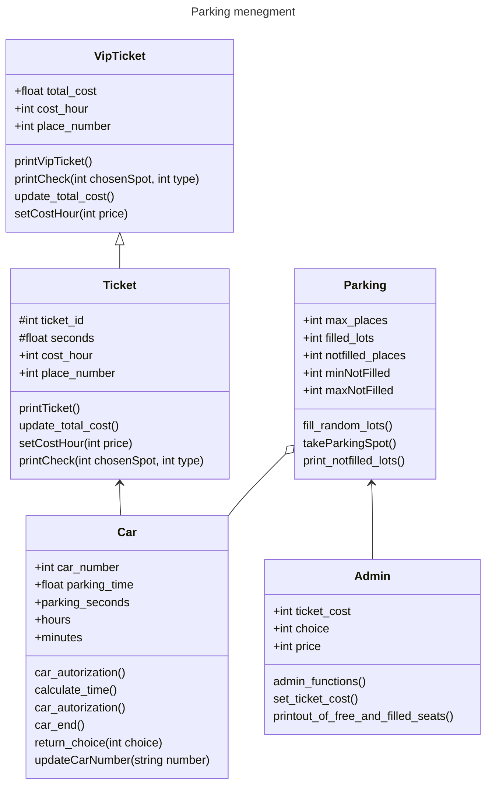

```mermaid
--- 
title: Parking menegment
---
classDiagram
    class Car
        Car : +int car_number
        Car : +float parking_time
        Car : +parking_seconds
        Car : +hours
        Car : +minutes
        Car : car_autorization()
        Car : calculate_time()
        Car : car_autorization()
        Car : car_end()
        Car : return_choice(int choice)
        Car : updateCarNumber(string number)

    class Parking
        Parking : +int max_places
        Parking : +int filled_lots
        Parking : +int notfilled_places
        Parking : fill_random_lots()
        Parking : +int minNotFilled
        Parking : +int maxNotFilled
        Parking : takeParkingSpot()
        Parking : print_notfilled_lots()

    class Ticket
        Ticket : #int ticket_id
        Ticket : #float seconds
        Ticket : +int cost_hour
        Ticket : +int place_number
        Ticket : printTicket()
        Ticket : update_total_cost()
        Ticket : setCostHour(int price)
        Ticket : printCheck(int chosenSpot, int type)
    
    class VipTicket
        VipTicket : +float total_cost
        VipTicket : +int cost_hour
        VipTicket : +int place_number
        VipTicket : printVipTicket()
        VipTicket : printCheck(int chosenSpot, int type)
        VipTicket : update_total_cost()
        VipTicket : setCostHour(int price)
        
    class Admin
        Admin: +int ticket_cost
        Admin: +int choice
        Admin: +int price
        Admin: admin_functions()
        Admin: set_ticket_cost()
        Admin: printout_of_free_and_filled_seats()

    VipTicket <|-- Ticket
    Ticket <-- Car
    Parking o-- Car
    Parking <-- Admin
```