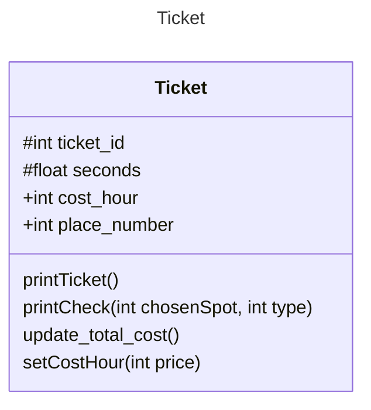

# Ticket

```mermaid
--- 
title: Ticket
---

classDiagram
    class Ticket
        Ticket : #int ticket_id
        Ticket : #float seconds
        Ticket : +int cost_hour
        Ticket : +int place_number
        Ticket : printTicket()
        Ticket : printCheck(int chosenSpot, int type)
        Ticket : update_total_cost()
        Ticket : setCostHour(int price)
```
