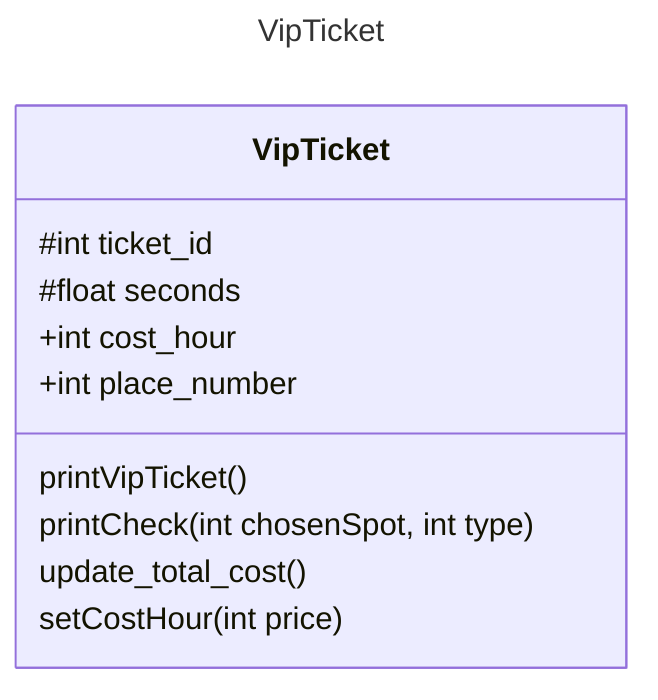

# VipTicket

```mermaid
--- 
title: VipTicket
---

classDiagram
    class VipTicket
        VipTicket : #int ticket_id
        VipTicket : #float seconds
        VipTicket : +int cost_hour
        VipTicket : +int place_number
        VipTicket : printVipTicket()
        VipTicket : printCheck(int chosenSpot, int type)
        VipTicket : update_total_cost()
        VipTicket : setCostHour(int price)
```
